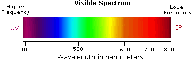

# Everyone sees different colors

I came to believe that you may see colors different than I do. And your best friend may see them in a complete other way too. I'll try to explain why.

Have you ever noticed that the way people like certain color combinations seem pretty random? For the same sort of image, you might like red and cyan together, whereas I might prefer the combination yellow and blue.

So from experience as a visual designer and obsessed observer of human behavior, I haven't found any color combination that everyone, or at least most people, seem to like. Except for one: rainbows. Everyone loves rainbows!

## The science behind colors

Before my hypothesis makes sense, I need to tell you some basic things about colors. The visible color spectrum humans can observe has been researched, and can be summarized in the graphic below. Simply put, a certain wavelength of a light particle equals to a specific color.

Mostly used by artists and designers, colors can also be visualized in a circle, as shown below. A color's tint is indicated by it's *hue* value, varying from 0° (red), to 180° (cyan) to 360° (again, red).

Note that a wavelength doesn't have a color, it's just a particle vibrating at a specific frequency. Our minds give this specific particle meaning because our eye (a light sensor) sends a signal to our brain that a specific frequency has been detected. Our brain, in turn, makes it part of our consciousness and creates an image of the world we *see*.

## Your red is my blue

So if the brain assigns a color to a specific wavelength, then why should this be the same for every person? Would this 'frequency-color-legend' be hardwired in our brains, or will chance play a role?

My hypothesis is that every human has a different 'hue-offset'. What does that mean? Look at the wheel above, and imagine playing a game called the 'birth-lottery'. You get born, and can spin the wheel like a Wheel of Furtune. Whichever position it ends up with will determine the colors you see for the rest of your life.

With other words, my 'hue-offset' might be an arbitrary number between 0° and 360° compared to yours. Image my 'hue-offset' is 120°. What you see as red, such as a rose or strawberries, is shifted a half circle, so blue for me. And what is blue for you, such as the sky, looks as red to me. See the image below.

We would both argue that the sky is blue and roses are red, because we wouldn't know better. But in our heads, what we *experience*, the colors may really differ.

## Why this might make sense

The following arguments have led me to believe that this might be a plausible hypothesis:

1. **Colors are simply tools of the brain to make sense of sensory input.**

  Some people experience something called [synesthesia](https://en.wikipedia.org/wiki/Synesthesia), simply put, they 'see' what they hear (some people even 'see' numbers). Interestingly enough, these are usually the kind of people who are very good musicians (or mathematicians, if they 'see' colored numbers).

  This leads me to believe that colors are simply a tool available to our brains, where in most cases it's mainly used for sight, but generally speaking just something our brain comes up with to make sense of the world. And the hue spectrum is something that we humans, more or less, probably have in common.

2. **Color combinations look good only if they're relatively the same.**
  
  I could ask for your favorite color, but that would be biased because of what you associate with it. For example, if blue is your favorite color, it might be because it reminds you of the sea or a clear sky. So a single color doesn't give any useful information for this hypothesis.

  So what if we talked about combinations? When asked people for a combination they like, it surprises me that the relative hue distance (in °) usually is the same. So when I like yellow (45°) and green (110°) together, which is a hue-shift difference of (110° - 45° = 65°), you might like blue (250°) and pink (315°) together, which has a delta of (250° - 180° = 65°). So their relative distance is the same, and maybe we are hardwired to like certain combinations of colors?

  This might also explain why almost everyone likes rainbows. A rainbow contains all colors we can see and they are distributed evenly.

Maybe the color spectrum isn't even the same across humans. It could very well be possible that some people only see a quarter, 0° to 90°, and so everything is red-yellow-green-ish. But for them that's the real world, so they wouldn't know better. Or maybe most of us are missing out on a lot of colors as well. Who knows!

I have thought long about a more scientific way of testing this hypothesis but I haven't come up with one. What people *experience *is still a fuzzy area to research.

In the meantime, this theory might be used for visual designers to take into account that what they're seeing is not what everyone might be seeing. *Everything's relative.*