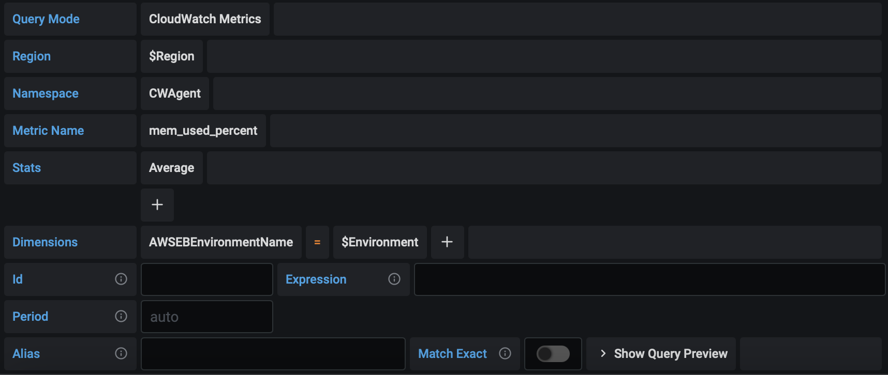
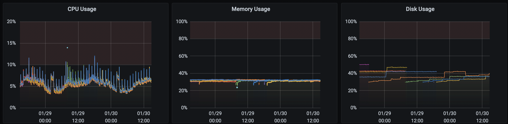

# Monitoring AWS Elastic Beanstalk Memory and Disk Usage in Grafana

By default AWS Elastic Beanstalk only monitors CPU, Network, etc. but no in-machine statistics such as the amounf of free memory and disk space usage.

Their [tutorial](https://docs.aws.amazon.com/elasticbeanstalk/latest/dg/customize-containers-cw.html) uses a CloudWatch Agent, but this only tags the instance ID (e.g. `i-12345`), which is very useless if you want to monitor in Grafana. What I want to see is the environment name (e.g. `myapp-prod`).

This solution uses a CloudWatch Agent to save metrics to CloudWatch as well, but tags all metrics with the environment name.

## 1. Setup AWS Elastic Beanstalk

Save this file as `/.ebextensions/cloudwatch.config` to automatically monitor and tag these into CloudWatch. You can then easily import those into Grafana (or the tool of your liking).

```yaml
packages:
  rpm:
    amazon-cloudwatch-agent: https://s3.amazonaws.com/amazoncloudwatch-agent/amazon_linux/amd64/latest/amazon-cloudwatch-agent.rpm
files:
  "/home/ec2-user/amazon-cloudwatch-agent.json":
    mode: "000755"
    owner: root
    group: root
    content: |
      {
        "agent": {
          "metrics_collection_interval": 60
        },
        "metrics": {
          "append_dimensions": {
            "InstanceId": "${aws:InstanceId}"
          },
          "metrics_collected": {
            "mem": {
              "measurement": [
                "mem_total",
                "mem_free",
                "mem_used",
                "mem_used_percent",
                "mem_available",
                "mem_available_percent"
              ],
              "append_dimensions": {
                "AWSEBEnvironmentName": "__EB_ENV__"
              }
            },
            "cpu": {
              "measurement": [
                "cpu_time_active",
                "cpu_time_nice",
                "cpu_time_steal",
                "cpu_usage_active",
                "cpu_usage_idle",
                "cpu_usage_iowait"
              ],
              "append_dimensions": {
                "AWSEBEnvironmentName": "__EB_ENV__"
              }
            },
            "disk": {
              "measurement": [
                "disk_free",
                "disk_total",
                "disk_used",
                "disk_used_percent"
              ],
              "append_dimensions": {
                "AWSEBEnvironmentName": "__EB_ENV__"
              }
            }
          }
        }
      }
container_commands:
  01_prepare_cloudwatch_agent_config:
    command: |
      EB_ENV="$(/opt/elasticbeanstalk/bin/get-config container -k environment_name)"
      sed -i "s/__EB_ENV__/$EB_ENV/g" /home/ec2-user/amazon-cloudwatch-agent.json
  02_run_cloudwatch_agent:
    command: |
      amazon-cloudwatch-agent-ctl -a fetch-config -m ec2 -c file:/home/ec2-user/amazon-cloudwatch-agent.json -s
```

## 2. Setup Grafana

In your Grafana dashboard, create two variables:


```
Name: Region
Type: Query
Data Source: CloudWatch
Query: regions()
```

```
Name: Environment
Type: Query
Data Source: CloudWatch
Query: dimension_values($Region,CWAgent,mem_free,AWSEBEnvironmentName)
```

And then create a Chart as follows:


You can make this a repeating row to monitor all your environments:


Good luck!